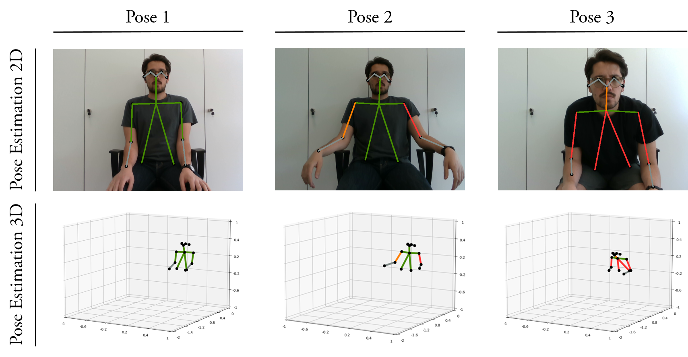

# 3D pose estimation for ergonomics analysis

_Marchello G, Abidi H, Farajtabar M, Lahoud M, Fontana E, D’Imperio M, Cannella F_

Sedentary lifestyle is widely known as a cause of different musculoskeletal disorders. The effects of sitting all day for work can however be mitigated by correcting the postures. Monitoring human pose to perform ergonomics analysis may help reporting wrong or potentially harmful postures, and consequently preventing health problems. In this paper, we propose a vision-based system tracking in real-time the pose of manufacturing operators in 3D. The pose estimation is performed by applying OpenPose [1] to the RGB images recorded by the depth camera RealSense d435i, and matching the results to their corresponding depth values. The angles of the joints composing the reconstructed skeleton are then computed, and are further used to evaluate the associated discomfort levels. Such values represent the deviations from optimal working limits, as suggested by current ergonomic studies. This work is part of the SOFTMANBOT project, a cross-sectorial project funded by the EU Horizon 2020 framework, automating textile production lines. Consequently, the project aims at increasing the productivity, yet reducing the health risks of the workers.

# Method


This method has its roots in the tf-pose-estimation by Ildoo Kim modified to work with Tensorflow 2.0+ (https://www.github.com/ildoonet/tf-openpose), and extends it to the depth map generated by the RealSense d435i. The human skeleton is composed of 18 different points (as in the image) connected to model the joints. Once the skeleton is reconstructed, the positions of the joints are exploited to compute the angles, by projecting them into the three orthogonal axes of the reference system, and recurring to basic geometry theorems. These angles are further analysed in order to evaluate the level of discomfort associated with the human posture. The ergonomics analysis is performed according to the study proposed by Kee et al., who defined the boundary conditions of the joints angles for sitting persons [2].

|                      	| Low Discomf 	| Moderate Discomf         	| High Discomf            	|
|----------------------	|-------------	|--------------------------	|-------------------------	|
| **Neck Rotation**    	| [-41°,41°]  	| [-58°,-41°), (41°,58°]   	| [-69°,-58°), (58°,69°]  	|
| **Neck Lat Bending** 	| [-28°,28°]  	| [-40°,-28°), (28°,40°]   	| [-48°,-40°), (40°,48°]  	|
| **Neck Extension**   	| [-19°,22°]  	| [-37°,-19°), (22°,47°] 	| [-53°,-37°), (47°,69°] 	|
| **Low Back Rotation**    	| [-17°,17°]  	| [-31°,-17°), (17°,31°]   	| [-45°,-31°), (31°,45°]  	|
| **Low Back Lat Bending** 	| [-6°,6°]  	| [-12°,-6°), (6°,12°]   	| [-17°,-12°), (12°,17°]  	|
| **Low Back Extension**   	| [0°,17°]  	| (17°,38°] 	| (38°,56°] 	|
| **Shoulder Extension** 	| [-13°,33°]  	| [-25°,-13°), (33°,75°]   	| [-36°,-25°), (75°,112°]  	|
| **Shoulder Adduction**   	| [-1°,1°]  	| [-17°,-1°), (1°,43°] 	| [-25°,-17°), (43°,73°] 	|

The joints composing the identified skeleton are colour-coded in green, yellow, and red for low, moderate, and high level of discomfrto, respectively. 



## How to run

The following instructions are meant for a Linux environment running Anaconda.
Download all the files present in the repository and open the Terminal in that folder.
Create a new conda environment and name it as you like (*myenv* is a placeholder)

```
conda create -n myenv python=3.8
```

Activate the environment and install all the requirements

```
conda activate myenv 
pip install -r requirements.txt
```

Install swig

```
cd core/tf_pose/pafprocess/
swig -python -c++ pafprocess.i 
python setup.py build
```

Go to the main folder and run 

```
python posenet_3d_stream.py    ### to evaluate ergonomics in real-time
python posenet_3d_snap.py      ### to evaluate ergonomics in one signle snap
```

## How to cite

```
@article{,
  title={3D pose estimation for ergonomics analysis of manufactory labours},
  author={Marchello, Gabriele and Abidi, Haider and Farajtabar, Mohammad and Lahoud, Marcel and Fontana, Eleonora and D'Imperio, Mariapaola and Cannella, Ferdinando},
  journal={},
  year={2022},
  publisher={}
}
```

### References 

[1] Cao, Zhe, et al. "Realtime multi-person 2d pose estimation using part affinity fields." Proceedings of the IEEE conference on computer vision and pattern recognition. 2017

[2] Kee, Dohyung, and Waldemar Karwowski. "The boundaries for joint angles of isocomfort for sitting and standing males based on perceived comfort of static joint postures." Ergonomics 44.6 (2001): 614-648.
